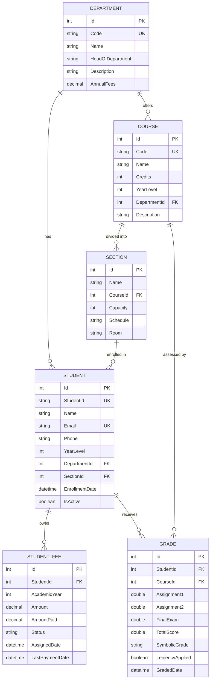

# Entity Relationship Diagram (ERD)
## NCT University Management System

---

## Mermaid ERD Diagram



---

## Visual ERD (ASCII Art)

```
╔═══════════════════════════════════════════════════════════════════════════════╗
║                         NCT UNIVERSITY DATABASE ERD                            ║
╚═══════════════════════════════════════════════════════════════════════════════╝

                              ┌─────────────────────┐
                              │     DEPARTMENT      │
                              ├─────────────────────┤
                              │ PK  Id              │
                              │ UK  Code            │
                              │     Name            │
                              │     HeadOfDepartment│
                              │     Description     │
                              │     AnnualFees      │
                              └─────────┬───────────┘
                                        │
                       ┌────────────────┼────────────────┐
                       │                │                │
                       │ 1              │ 1              │
                       ▼ N              ▼ N              │
          ┌────────────────────┐  ┌────────────────────┐ │
          │      STUDENT       │  │       COURSE       │ │
          ├────────────────────┤  ├────────────────────┤ │
          │ PK  Id             │  │ PK  Id             │ │
          │ UK  StudentId      │  │ UK  Code           │ │
          │     Name           │  │     Name           │ │
          │ UK  Email          │  │     Credits        │ │
          │     Phone          │  │     YearLevel      │ │
          │     YearLevel      │  │ FK  DepartmentId ──┘ │
          │ FK  DepartmentId ──┘  │     Description    │
          │ FK  SectionId ──────┐ └─────────┬──────────┘
          │     EnrollmentDate  │           │
          │     IsActive        │           │ 1
          └──────────┬──────────┘           ▼ N
                     │            ┌────────────────────┐
                     │            │      SECTION       │
        ┌────────────┼────────────┤────────────────────┤
        │            │            │ PK  Id             │
        │ 1          │            │     Name           │
        ▼ N          │            │ FK  CourseId ──────┘
┌───────────────────┐│            │     Capacity (40)  │
│   STUDENT_FEE     ││            │     Schedule       │
├───────────────────┤│            │     Room           │
│ PK  Id            ││            └────────────────────┘
│ FK  StudentId ────┘│
│     AcademicYear   │    1
│     Amount         │◄───────────────┐
│     AmountPaid     │                │
│     Status         │                │
│     AssignedDate   │                │
│     LastPaymentDate│                │
└───────────────────┘                 │
                                      │
        ┌─────────────────────────────┘
        │
        │ 1          ┌────────────────────┐
        ▼ N          │       GRADE        │
┌───────────────────┐├────────────────────┤
│    (Student)      ││ PK  Id             │
│                   ││ FK  StudentId      │◄── From STUDENT
└───────────────────┘│ FK  CourseId       │◄── From COURSE
                     │     Assignment1    │
                     │     Assignment2    │
                     │     FinalExam      │
                     │     TotalScore     │
                     │     SymbolicGrade  │
                     │     LeniencyApplied│
                     │     GradedDate     │
                     └────────────────────┘
```

---

## Relationships Detail

### 1. Department ↔ Student (One-to-Many)
```
DEPARTMENT (1) ─────────────────▶ (N) STUDENT
    │                                    │
    │ One department can have            │
    │ many students enrolled             │
    │                                    │
    └─ DepartmentId in Student references Department.Id
```

### 2. Department ↔ Course (One-to-Many)
```
DEPARTMENT (1) ─────────────────▶ (N) COURSE
    │                                    │
    │ One department can offer           │
    │ many courses                       │
    │                                    │
    └─ DepartmentId in Course references Department.Id
```

### 3. Course ↔ Section (One-to-Many)
```
COURSE (1) ─────────────────────▶ (N) SECTION
    │                                    │
    │ One course can be divided          │
    │ into multiple sections             │
    │                                    │
    └─ CourseId in Section references Course.Id
```

### 4. Section ↔ Student (One-to-Many)
```
SECTION (1) ────────────────────▶ (N) STUDENT
    │                                    │
    │ One section can have               │
    │ up to 40 students                  │
    │                                    │
    └─ SectionId in Student references Section.Id
```

### 5. Student ↔ StudentFee (One-to-Many)
```
STUDENT (1) ────────────────────▶ (N) STUDENT_FEE
    │                                    │
    │ One student has fee records        │
    │ for each academic year (1-4)       │
    │                                    │
    └─ StudentId in StudentFee references Student.Id
       CASCADE DELETE enabled
```

### 6. Student ↔ Grade (One-to-Many)
```
STUDENT (1) ────────────────────▶ (N) GRADE
    │                                    │
    │ One student can have grades        │
    │ in multiple courses                │
    │                                    │
    └─ StudentId in Grade references Student.Id
       CASCADE DELETE enabled
```

### 7. Course ↔ Grade (One-to-Many)
```
COURSE (1) ─────────────────────▶ (N) GRADE
    │                                    │
    │ One course can have grades         │
    │ from multiple students             │
    │                                    │
    └─ CourseId in Grade references Course.Id
       UNIQUE constraint on (StudentId, CourseId)
```

---

## Cardinality Summary Table

| Parent Entity | Child Entity | Cardinality | Cascade Delete |
|---------------|--------------|-------------|----------------|
| Department | Student | 1:N | No |
| Department | Course | 1:N | No |
| Course | Section | 1:N | No |
| Course | Grade | 1:N | No |
| Section | Student | 1:N | No |
| Student | StudentFee | 1:N | Yes |
| Student | Grade | 1:N | Yes |

---

## Constraints

### Primary Keys (PK)
- All tables have auto-incrementing integer `Id` as primary key

### Foreign Keys (FK)
| Table | Column | References | On Delete |
|-------|--------|------------|-----------|
| Student | DepartmentId | Department.Id | SET NULL |
| Student | SectionId | Section.Id | SET NULL |
| Course | DepartmentId | Department.Id | SET NULL |
| Section | CourseId | Course.Id | CASCADE |
| StudentFee | StudentId | Student.Id | CASCADE |
| Grade | StudentId | Student.Id | CASCADE |
| Grade | CourseId | Course.Id | CASCADE |

### Unique Constraints (UK)
- Department.Code
- Student.StudentId
- Student.Email
- Course.Code
- Grade(StudentId, CourseId) - composite unique

### Check Constraints
- Student.YearLevel: 1-4
- Course.YearLevel: 1-4
- Course.Credits: 1-6
- StudentFee.AcademicYear: 1-4
- Grade scores (Assignment1, Assignment2, FinalExam): 0-100

---

## Data Flow Diagram

```
┌──────────────────────────────────────────────────────────────────────────┐
│                           USER INTERACTION                                │
└────────────────────────────────────┬─────────────────────────────────────┘
                                     │
                                     ▼
┌──────────────────────────────────────────────────────────────────────────┐
│                              WPF VIEWS                                    │
│  ┌─────────┐ ┌─────────┐ ┌─────────┐ ┌─────────┐ ┌─────────┐ ┌─────────┐ │
│  │Dashboard│ │Students │ │ Depts   │ │ Courses │ │  Fees   │ │ Grades  │ │
│  └────┬────┘ └────┬────┘ └────┬────┘ └────┬────┘ └────┬────┘ └────┬────┘ │
└───────┼──────────┼─────────┼─────────┼─────────┼─────────┼───────────────┘
        │          │         │         │         │         │
        ▼          ▼         ▼         ▼         ▼         ▼
┌──────────────────────────────────────────────────────────────────────────┐
│                            VIEWMODELS                                     │
│         Data Binding │ Commands │ Validation │ Business Logic            │
└────────────────────────────────────┬─────────────────────────────────────┘
                                     │
                                     ▼
┌──────────────────────────────────────────────────────────────────────────┐
│                              SERVICES                                     │
│  ┌──────────────────┐ ┌──────────────────┐ ┌──────────────────┐          │
│  │  GradingService  │ │  ReportService   │ │ValidationService │          │
│  │ - CalculateGrade │ │ - GetStats       │ │ - ValidateEmail  │          │
│  │ - ApplyLeniency  │ │ - GetDistribution│ │ - ValidateScore  │          │
│  └──────────────────┘ └──────────────────┘ └──────────────────┘          │
└────────────────────────────────────┬─────────────────────────────────────┘
                                     │
                                     ▼
┌──────────────────────────────────────────────────────────────────────────┐
│                       ENTITY FRAMEWORK CORE                               │
│                      UniversityDbContext                                  │
│  ┌──────────┐ ┌──────────┐ ┌──────────┐ ┌──────────┐ ┌──────────┐        │
│  │DbSet<    │ │DbSet<    │ │DbSet<    │ │DbSet<    │ │DbSet<    │        │
│  │Department│ │Student>  │ │Course>   │ │Section>  │ │Grade>    │        │
│  └──────────┘ └──────────┘ └──────────┘ └──────────┘ └──────────┘        │
└────────────────────────────────────┬─────────────────────────────────────┘
                                     │
                                     ▼
┌──────────────────────────────────────────────────────────────────────────┐
│                          SQLite DATABASE                                  │
│                           university.db                                   │
└──────────────────────────────────────────────────────────────────────────┘
```

---

## Entity Properties Reference

### Department
| Property | Type | Constraints | Description |
|----------|------|-------------|-------------|
| Id | int | PK, Auto | Unique identifier |
| Code | string | UK, Required, Max 10 | Department code (e.g., CS, IT) |
| Name | string | Required, Max 100 | Full department name |
| HeadOfDepartment | string | Max 100 | Head faculty name |
| Description | string | - | Department description |
| AnnualFees | decimal | Default 0 | Yearly tuition in EGP |

### Student
| Property | Type | Constraints | Description |
|----------|------|-------------|-------------|
| Id | int | PK, Auto | Unique identifier |
| StudentId | string | UK, Max 20 | NCT ID (e.g., NCT00001) |
| Name | string | Required, Max 100 | Full name |
| Email | string | UK, Required, Email format | Contact email |
| Phone | string | Max 20 | Egyptian phone format |
| YearLevel | int | 1-4 | Academic year |
| DepartmentId | int? | FK | Assigned department |
| SectionId | int? | FK | Assigned section |
| EnrollmentDate | DateTime | Default Now | Registration date |
| IsActive | bool | Default true | Enrollment status |

### Course
| Property | Type | Constraints | Description |
|----------|------|-------------|-------------|
| Id | int | PK, Auto | Unique identifier |
| Code | string | UK, Required | Course code (e.g., CS101) |
| Name | string | Required | Course name |
| Credits | int | 1-6 | Credit hours |
| YearLevel | int | 1-4 | Target year |
| DepartmentId | int? | FK | Offering department |
| Description | string | - | Course description |

### Section
| Property | Type | Constraints | Description |
|----------|------|-------------|-------------|
| Id | int | PK, Auto | Unique identifier |
| Name | string | Required | Section name |
| CourseId | int | FK, Required | Parent course |
| Capacity | int | Default 40 | Max students |
| Schedule | string | - | Class schedule |
| Room | string | - | Room assignment |

### StudentFee
| Property | Type | Constraints | Description |
|----------|------|-------------|-------------|
| Id | int | PK, Auto | Unique identifier |
| StudentId | int | FK, Required | Student reference |
| AcademicYear | int | 1-4 | Fee year |
| Amount | decimal | Required | Fee amount in EGP |
| AmountPaid | decimal | Default 0 | Paid amount |
| Status | enum | Pending/Partial/Paid/Overdue | Payment status |
| AssignedDate | DateTime | Default Now | Fee assigned date |
| LastPaymentDate | DateTime? | - | Last payment date |

### Grade
| Property | Type | Constraints | Description |
|----------|------|-------------|-------------|
| Id | int | PK, Auto | Unique identifier |
| StudentId | int | FK, Required | Student reference |
| CourseId | int | FK, Required | Course reference |
| Assignment1 | double? | 0-100 | First assignment score |
| Assignment2 | double? | 0-100 | Second assignment score |
| FinalExam | double? | 0-100 | Final exam score |
| TotalScore | double? | Calculated | Weighted total |
| SymbolicGrade | string | D/M/P/NA | Letter grade |
| LeniencyApplied | bool | Default false | Leniency flag |
| GradedDate | DateTime? | - | Grading date |

---

*Generated for NCT University Management System v1.0.0*

